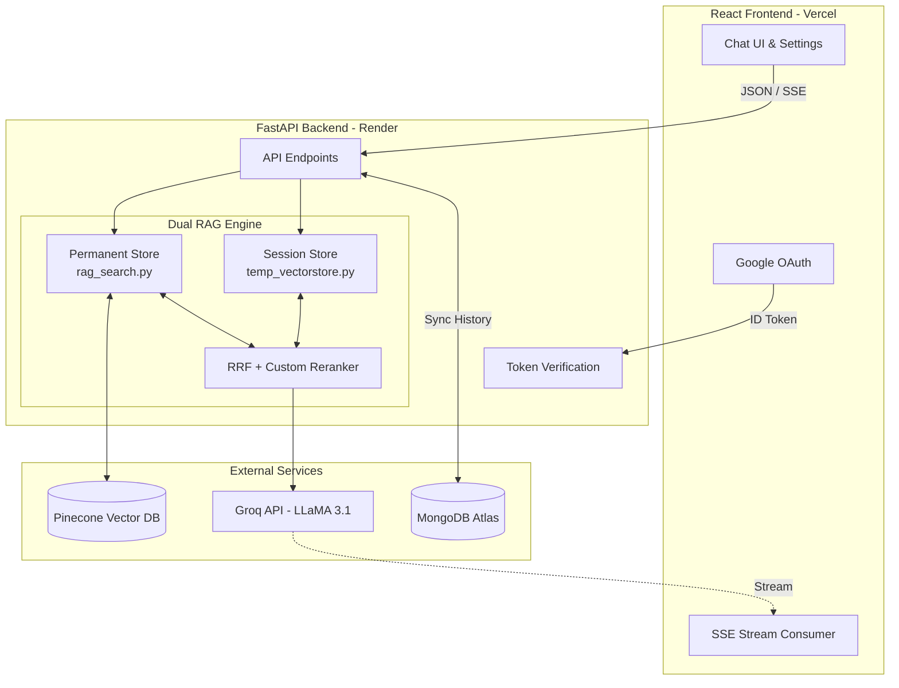

# PlacementPrep AI 🚀

> A production-grade, full-stack RAG-based placement preparation assistant. Powered by Hybrid Search (Pinecone), MongoDB, Groq LLM, Google OAuth, and a React frontend.

[](https://placement-prep-rag.vercel.app)
[](https://placementpreprag.onrender.com)
[](https://python.org)
[](https://fastapi.tiangolo.com)
[](https://react.dev)
[](https://mongodb.com)

---

## 🌟 What is PlacementPrep AI?

PlacementPrep AI is an intelligent placement preparation assistant built for CSE students targeting major IT recruiters (TCS, Infosys, IBM, Wipro, etc.). 

Users can query an extensive curated index of past interview experiences and NQT papers, or **upload their own PDFs** to dynamically query them in real-time. By leveraging **Retrieval-Augmented Generation (RAG)**, every answer is strictly grounded in real-world data and properly cited.

---

## 🔥 Key Features

### 🧠 Advanced RAG Architecture
- **Hybrid Search Pipeline** — Combines semantic vector search (Pinecone) with BM25 keyword search for pinpoint accuracy.
- **Reciprocal Rank Fusion (RRF)** — Intelligently merges ranked results from dense and sparse retrievers.
- **Custom Reranker** — Re-scores top candidates on the fly using term overlap, bigram matching, and position boosting.
- **Source Attribution** — Every AI response includes direct citations to the source PDF.

### ⚡ Full-Stack & Real-Time
- **Google OAuth Integration** — Secure, seamless sign-in via Google Identity Services (GIS).
- **Persistent Chat History** — Chats are saved to **MongoDB Atlas** and synced across devices for logged-in users.
- **SSE Streaming (Typewriter Effect)** — Real-time response streaming from FastAPI to React via Server-Sent Events, matching the ChatGPT experience.
- **PDF Upload & Ephemeral Stores** — Upload any PDF to create a temporary, RAM-based vector store (with a 2-hour TTL) without polluting the primary Pinecone index.

### 🎨 Premium UI/UX
- **Glassmorphic UI** — React + Vite + Tailwind CSS frontend with a sleek dark mode and custom CSS themes (Slate, Light, Cyberpunk, Mint).
- **Interactive Quick Prompts** — Context-aware suggested prompts that move to the sidebar upon interaction.
- **Syntax Highlighting & Copy** — Code blocks in AI responses are fully formatted with one-click copy buttons.
- **Custom Modals** — Avoids native browser alerts in favor of animated React components for Help docs and destructive actions (Purge DB).

---

## 🏗 Architecture



---

## 🛠 Tech Stack

| Domain | Technologies |
|---|---|
| **Frontend** | React 18, Vite, TypeScript, Tailwind CSS, Lucide Icons |
| **Backend** | FastAPI, Python 3.12, Uvicorn, Pydantic |
| **Databases** | Pinecone (Vector), MongoDB Atlas (State/History) |
| **AI / ML** | Groq API (`llama-3.1-8b-instant`), Sentence Transformers (`all-MiniLM-L6-v2`) |
| **Auth** | Google Identity Services (GIS), `google-auth` |
| **Deployment** | Vercel (Frontend), Render (Backend), GitHub Actions (CI) |

---

## 🚀 Running Locally

### Prerequisites
- Python 3.12+
- Node.js 18+
- Accounts/Keys: Pinecone, Groq, MongoDB Atlas, Google Cloud Console (OAuth Client ID)

### Backend Setup
```bash
# Clone repo
git clone https://github.com/ari2387q/PlacementPrepRAG.git
cd PlacementPrepRAG/backend

# Create virtual environment
python -m venv .venv
source .venv/bin/activate  # On Windows: .venv\Scripts\activate

# Install dependencies
pip install -r requirements.txt

# Create .env file
echo 'GROQ="your_groq_api_key"' > .env
echo 'PINECONE_API_KEY="your_pinecone_api_key"' >> .env
echo 'PINECONE_INDEX="placement-prep"' >> .env
echo 'MONGODB_URI="mongodb+srv://..."' >> .env
echo 'GOOGLE_CLIENT_ID="your_google_client_id"' >> .env
echo 'GOOGLE_CLIENT_SECRET="your_google_client_secret"' >> .env

# Run backend
uvicorn main:app --reload
```

### Frontend Setup
```bash
cd ../frontend

# Install dependencies
npm install

# Create .env.local file
echo 'VITE_API_URL="http://localhost:8000"' > .env.local
echo 'VITE_GOOGLE_CLIENT_ID="your_google_client_id"' >> .env.local

# Run frontend
npm run dev
```

---

## 🧠 Key Engineering Decisions

1. **Why Hybrid Search over pure vector search?**
   Pure vector search misses exact keyword matches. Searching "TCS NQT" might not retrieve specific NQT paper chunks if the embedding model treats it as noise. BM25 excels at exact matches. Reciprocal Rank Fusion (RRF) combines both — chunks appearing in both ranked lists score higher.
2. **MongoDB for State, Pinecone for Vectors**
   Separating concerns allows infinite scaling. Pinecone handles high-dimensional cosine similarity math, while MongoDB handles traditional CRUD operations for user chat histories and sessions.
3. **Server-Sent Events (SSE) over WebSockets**
   For AI text generation, communication is entirely unidirectional (Server → Client). SSE is lighter, easier to proxy through cloud load balancers, and natively supported by standard HTTP connections compared to WebSockets.
4. **Temporary RAM Vector Stores**
   User-uploaded PDFs are ingested into a temporary, in-memory vector store with a 2-hour TTL. Storing them in the primary Pinecone index would pollute the database with unvetted data and drastically increase cloud costs.

---

## 👨‍💻 Author

**Aryan Nair** — BTech CSE @ RIT Kottayam  
GitHub: [@ari2387q](https://github.com/ari2387q)

---

## 📄 License
MIT License — feel free to use this as a reference for your own RAG projects.
